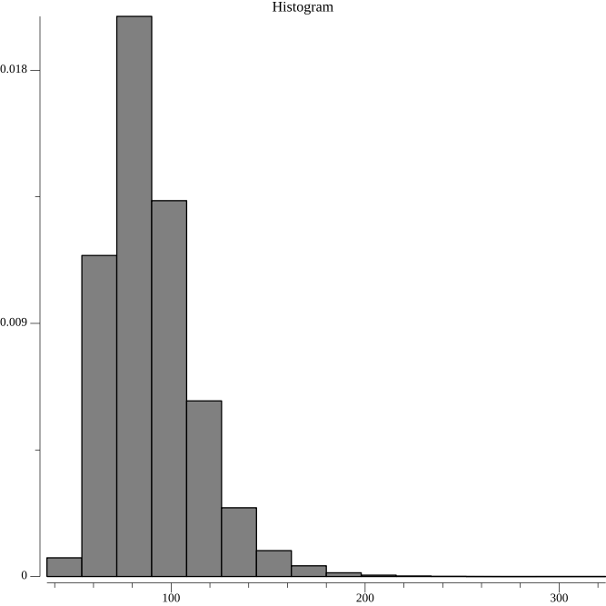

# Animal Crossing: New Horizons Fossil Simulator

This is a lazily-written simulation that calculates the average number of in-game days to collect all fossils in Animal Crossing: New Horizons for the Nintendo Switch. This simulation is written in Go, and uses the following assumptions:

1. The player plays each day, meaning that there are four new fossils generated each day.
2. Each fossil generated is chosen from the set of all fossils. (I have no idea if this is true)

Here's a 5 figure summary of the distribution:

```
Minimum: 36
1st Quartile (Q1): 73
Median: 85
3rd Quartile (Q3): 101
Maximum: 324
Mean: 89.37
Most common: 78, which happened 0.02% of the time
Function took 1.619366667s
```

Here's what the final distribution looked like when I simulated 10,000 playthroughs.


